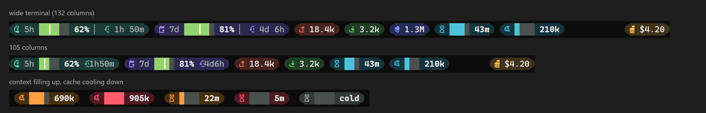
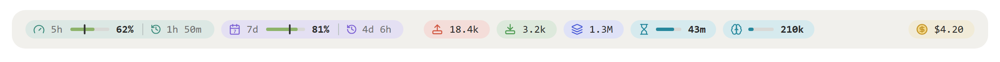

# claude-usage-band

A Claude Code plugin marketplace with one mod, `usage-band`: a band above the prompt showing quota, tokens, context, cache warmth and session cost.

Preview renders:





## Pills

| Pill | Shows |
| --- | --- |
| 5h | Percent of the 5-hour quota left. The bar is the quota left, the tick is the time left in the window; shows the time until reset. |
| 7d | Same for the 7-day quota. |
| Tokens up | Input tokens plus cache writes. |
| Tokens down | Output tokens. |
| Cache reads | Tokens read from the prompt cache. |
| Cache warm | Time the main thread's prompt cache stays warm after its last response: `57m`, `<1m`, or `cold`; bar and colour show the share of the TTL left. |
| Context | Tokens of the last request. Bar and colour by fill: under 60% calm, 60-85% amber, over 85% red. |
| Cost | Session cost in US dollars. |

## When figures update

- After every API response: quota, cost, context fill, token totals and the cache countdown.
- Reset countdowns redraw every 30 seconds.
- Token totals, context and the cache countdown start over on `/clear` and on resume.

## Requirements

- Claude Code v2.1.287 or later (mods).
- Draws in the terminal and in the Desktop app Code tab.
- Terminal icons and round pill ends need a Nerd Font (e.g. CaskaydiaMono Nerd Font). Without one, set `glyphs` to `unicode`.

## Install

Inside Claude Code:

```
/plugin marketplace add brooklyn96/claude-usage-band
/plugin install usage-band@claude-usage-band
```

From a shell:

```
claude plugin marketplace add brooklyn96/claude-usage-band
claude plugin install usage-band@claude-usage-band
```

In an open session, run `/reload-plugins` to pick it up.

Update:

```
claude plugin update usage-band@claude-usage-band
```

## Options

`glyphs`: `nerd` (default) or `unicode`. Set it through `/plugin` (configure).

`cacheTtl`: `1h` (default) or `5m` — how long the main thread's prompt cache stays warm, and so what the warm pill counts down from.

## Narrow terminals

When the row does not fit, the cache pill drops first, then bars shorten and time labels go compact, then the token up/down pills hide too, then every pill wraps onto the next line at full size.

## Development

```
claude plugin validate usage-band
claude plugin test usage-band
```

Type-check after the mod has loaded, since the engine writes `usage-band/.claude-plugin/types` on load:

```
npx -y -p typescript@5.6 tsc -p usage-band --noEmit
```

## Security

A mod runs with your permissions. This one makes no network calls, writes no files and starts no processes.

## License

MIT.
